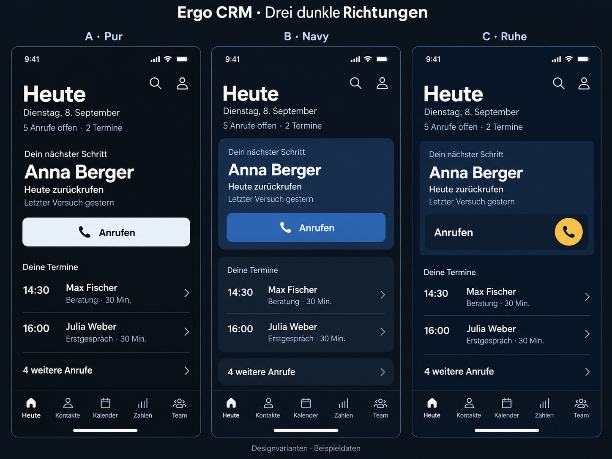

# Ergo CRM – drei dunkle Designrichtungen

Stand: 08.09.2026. Visuelle Alternativen zur gemeinsamen Planung. Keine App-Implementierung.

**Gespeicherte Nutzerpräferenz aus der folgenden Rückmeldung:** B – Navy gefällt bisher am besten. Das ist die Basis für weitere Entwürfe, noch keine endgültige Auswahl. Die Anordnung soll stärker an bekannte iPhone-Apps und das klare Design von Trade Republic anschließen. Weitere Richtungen werden visuell verglichen; der Nutzer möchte anhand der Bilder entscheiden.

## Rückmeldung zu V1

Die Richtung für Findbarkeit und Orientierung passt grundsätzlich. Der helle visuelle Entwurf gefällt noch nicht ausreichend; gesucht wird ein dunklerer, klarerer, professionellerer Eindruck. Die hellen Ansichten aus V1 sind damit keine freigegebene Gestaltungsgrundlage. Die genaue visuelle Richtung bleibt offen.

Zum direkten Vergleich zeigen alle Varianten dieselben Beispieldaten und Aktionen. Die Navigation Heute, Kontakte, Kalender, Zahlen und Team bleibt bestehen. Die Kopfzeile ist reduziert: Seitentitel sowie Suche und Profil; keine zusätzliche Logozeile über dem Seitentitel.

| Variante | Gestalterische Idee | Eindruck und Abwägung |
| --- | --- | --- |
| A – Pur | Fast schwarzes Navy, durchgehende Fläche, freistehende Inhalte, helle Hauptaktion | Stärkste Reduktion und klarer Kontrast. Gliederung entsteht hauptsächlich durch Abstand und Schrift. Die helle Aktion setzt einen deutlichen Schwerpunkt. |
| B – Navy | Tiefes Navy, ein abgesetzter Bereich für den nächsten Schritt, zusammengefasste Termine, blauer Button | Inhalte sind stärker gruppiert und abgegrenzt. Wirkt etwas weicher und hat mehr sichtbare Flächen als A. |
| C – Ruhe | Navy, zurückhaltender Bereich für den nächsten Schritt, dunkle Aktionszeile und ein einzelner Goldakzent | Der kleine Goldakzent führt zur Hauptaktion. Die gesamte Zeile muss als bedienbar erkennbar sein und reagieren; das runde Symbol ist nicht das einzige Berührungsziel. |

## Einschätzung

Die ursprüngliche gestalterische Empfehlung war A. Die anschließende Nutzerpräferenz hat Vorrang: B – Navy ist der vorläufige Favorit und die Grundlage für die nächste Runde. C bleibt als Vergleich für einen sparsamen Einsatz des bestehenden Goldtons erhalten. Eine endgültige Variante ist noch nicht festgelegt.

Die Tafel ist mit dem Bildgenerator erstellt und nicht bedienbar. Die Darstellung hilft bei der Auswahl einer Richtung. Genaue Farbwiedergabe, Schriftgewichte und Kontraste sind nicht als technisch geprüft zu verstehen. Für spätere Layouts gelten deckende Flächen und präzise definierte Farben; Unschärfe, dekorative Verläufe und Schatten sind nicht Teil der vorgesehenen Gestaltung.

Nach Auswahl einer Richtung werden Kontakte und Anrufablauf entsprechend ausgearbeitet. Die vorhandenen fachlichen Abläufe und Ausnahmezustände stehen weiterhin im [mobilen Designentwurf](../mobile-design-entwurf.md). Änderungen an App-Code sind durch diese Variantenrunde nicht beauftragt.

Das vollständige verwendete [Bildbriefing](dunkle-varianten-v2-prompt.md) ist separat gespeichert.
