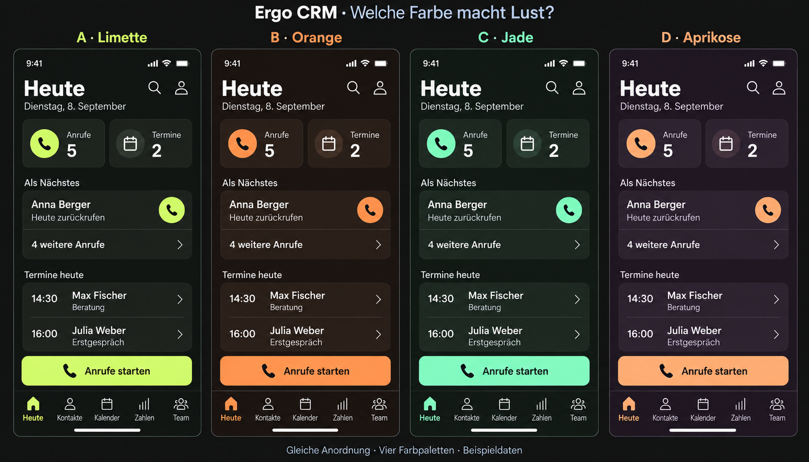

# Ergo CRM – neue Farbpaletten V4

**Aktualisierung 08.09.2026:** Navy/Blau/Weiß wurde wieder bestätigt. V4 bleibt nur als verworfene Erkundung erhalten. Verbindlich ist [Arbeitslagen](../arbeitslagen-umsetzung.md). Die nachfolgenden Rückmeldungen dokumentieren den damaligen Zwischenstand.

Aktuelle visuelle Auswahlrunde. Keine App-Implementierung.

## Entscheidung und Auftrag

Die Anordnungen aus V3 gefallen dem Nutzer. Die bisherige Blau-Weiß-/Navy-Palette passt nicht. Der Nutzer erlaubt ausdrücklich eine andere Farbpalette und wünscht einen Auftritt, der Lust auf Benutzung macht. Damit ist die anfängliche Vorgabe, ausschließlich die bestehenden Farben zu nutzen, für die weitere Planung aufgehoben. Der dunkle Grundcharakter bleibt; eine endgültige neue Palette ist noch nicht gewählt.

Alle vier Varianten verwenden dieselbe iPhone-Liste aus V3. Die Auswahl dieser Ansicht für den Farbvergleich legt die spätere Startseite nicht fest. Die Bilder vergleichen Farbe; Anordnung und Daten werden bewusst konstant gehalten. Alle Daten sind Beispiele.

| Variante | Hintergrund | Fläche | Text | Sekundärtext | Akzent |
| --- | --- | --- | --- | --- | --- |
| A – Graphit und Limette | `#101211` | `#20241F` | `#F2F5E8` | `#A5ABA0` | `#C8FA55` |
| B – Espresso und Orange | `#191411` | `#2A211B` | `#FFF1E5` | `#BDA99A` | `#FF9457` |
| C – Anthrazit und Jade | `#121713` | `#202A23` | `#F1F5ED` | `#A7B6AC` | `#72E5A6` |
| D – Pflaume und Aprikose | `#211923` | `#302534` | `#F8EEF5` | `#BEAFC0` | `#FFB581` |

Auf gefüllten Akzentbuttons verwenden alle Varianten dunkle Schrift in der jeweiligen Hintergrundfarbe. Helle Texte bleiben für dunkle Flächen erhalten. Die Akzentfarbe erscheint an gezielten Aktionen und dem aktiven Tab; die ganze Seite wird nicht bunt eingefärbt.

## Gestalterische Einschätzung

- **A:** Starkes Gelbgrün, markanter und sportlicher Eindruck.
- **B:** Warmer Orangeton vor einem warmen dunklen Grund.
- **C:** Frischer Grünton mit einem ruhigeren Gesamteindruck als A.
- **D:** Zurückhaltendes dunkles Pflaume mit einem warmen Aprikoseton.

Diese Eindrücke sind gestalterische Einschätzungen. Keine Palette wird als nachweislich motivationssteigernd dargestellt. Entscheidend ist zunächst die Nutzerreaktion auf den Bildvergleich, später die Wirkung im tatsächlichen Arbeitsablauf. Farbwahl und Anordnungswahl werden getrennt festgehalten.

## Rechnerische Kontrastvorprüfung

Die folgenden Werte wurden für die festgelegten deckenden sRGB-Farbpaare berechnet. Sie beschreiben nicht die möglicherweise abweichenden Pixel des generierten Bildes.

| Variante | Text auf Fläche | Sekundärtext auf Fläche | Dunkler Buttontext auf Akzent |
| --- | --- | --- | --- |
| A | 14,25:1 | 6,70:1 | 15,46:1 |
| B | 14,24:1 | 6,99:1 | 8,37:1 |
| C | 13,43:1 | 7,01:1 | 11,64:1 |
| D | 12,88:1 | 7,00:1 | 9,92:1 |

Alle geprüften Textpaare liegen über 4,5:1. Die Gruppenflächen unterscheiden sich hingegen nur schwach vom Hintergrund (etwa 1,16–1,22:1). Für rein räumliche Gruppierung ist das vorgesehen; notwendige Eingabe- oder Bediengrenzen brauchen zusätzlich erkennbare Konturen oder Symbole. Sekundärtext darf nicht zusätzlich transparent gesetzt werden. Das ist keine vollständige Prüfung der Barrierefreiheit. [WCAG: Textkontrast](https://www.w3.org/TR/WCAG22/#contrast-minimum), [WCAG: Nichttextkontrast](https://www.w3.org/WAI/WCAG22/understanding/non-text-contrast.html)

Bei einer späteren Umsetzung werden Statusfarben für Fehler, Erfolg und Warnungen gesondert festgelegt und immer auch durch Text oder Symbole verständlich gemacht. Aus einem grünen Markenakzent folgt beispielsweise keine automatische Erfolgsmeldung.

## Ablage und nächste Auswahl

Erstellt mit dem eingebauten Bildgenerator. [Vollständiges Bildbriefing](farbpaletten-v4-prompt.md). Die bisherigen [Anordnungen V3](iphone-anordnungen-v3.md) bleiben gespeichert. Nächste Entscheidung: bevorzugte Palette anhand des Bildes benennen; bei Bedarf einzelne Akzent- oder Grundfarben gezielt nachjustieren. Noch keine Palette ist freigegeben oder in die App übernommen.
