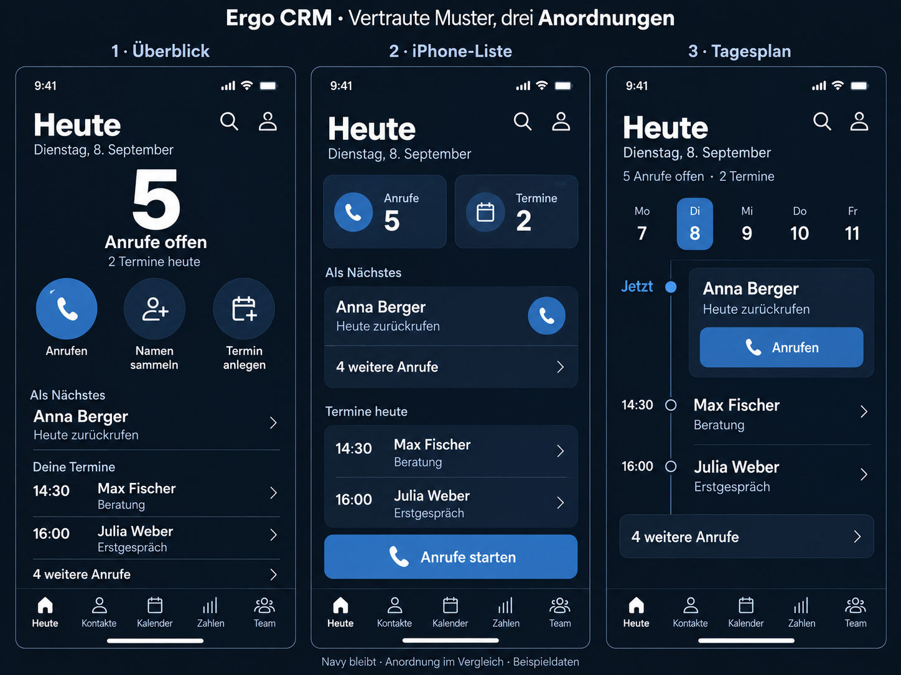
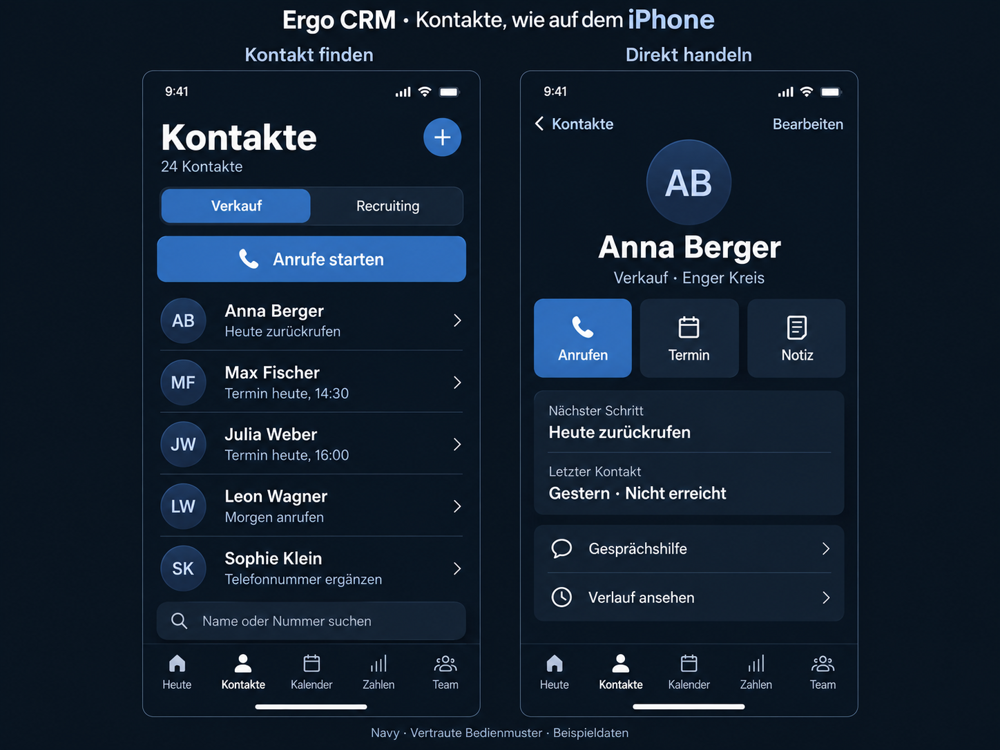

# Ergo CRM – vertraute Anordnungen V3

**Aktualisierung 08.09.2026:** Navy/Blau/Weiß wurde wieder bestätigt. V4 bleibt nur als verworfene Erkundung erhalten. Verbindlich ist [Arbeitslagen](../arbeitslagen-umsetzung.md). Die nachfolgenden Rückmeldungen dokumentieren den damaligen Zwischenstand.

Visuelle Planungsrunde. Alle Personen, Mengen und Zeiten sind Beispieldaten. Keine App-Implementierung.

1. **Überblick:** Große Anzahl offener Anrufe und drei beschriftete Direktaktionen. Darunter folgen die konkrete Person und heutige Termine.
2. **iPhone-Liste:** Kleine Übersichten mit Zählern und gruppierte Aufgaben-/Terminzeilen. Die Hauptaktion steht gut erreichbar oberhalb der Navigation.
3. **Tagesplan:** Datumsleiste und zeitlich geordnete Agenda. Der nächste Anruf steht unter „Jetzt“, ohne einen erfundenen Termin zu erhalten.

Die ergänzende Kontaktansicht zeigt einen klassischen Rückweg, direkt erreichbare Aktionen unter dem Namen sowie knapp gruppierte Informationen zum letzten Kontakt und nächsten Schritt. Die Kontaktsuche unten muss später gemeinsam mit Tastatur und Tabbar im echten iPhone-Viewport geprüft werden.

## Gespeicherte Rückmeldung

Der Nutzer bewertet diese Runde ausdrücklich positiv, einschließlich der drei Anordnungen. Eine einzelne Startseiten-Anordnung wurde noch nicht ausgewählt. Die bisherige Blau-Weiß-/Navy-Farbgebung passt jedoch nicht und soll durch neue, ansprechende und als motivierend empfundene Paletten ersetzt werden. Dafür folgt [Farbpaletten V4](farbpaletten-v4.md). Die Anordnungen bleiben als Grundlage erhalten.

Die bestehenden Bedingungen für den Einstieg gelten weiterhin: Bei neuen Nutzern führt die Hauptaktion direkt zur geführten Namensammlung. Die Bildbeispiele zeigen einen bereits gefüllten Alltag und ersetzen den Zustand ohne Namen nicht.

[Recherche und offizielle Referenzen](iphone-referenzen-v3.md) · [Verwendete Bildbriefings](iphone-bildbriefings-v3.md)
