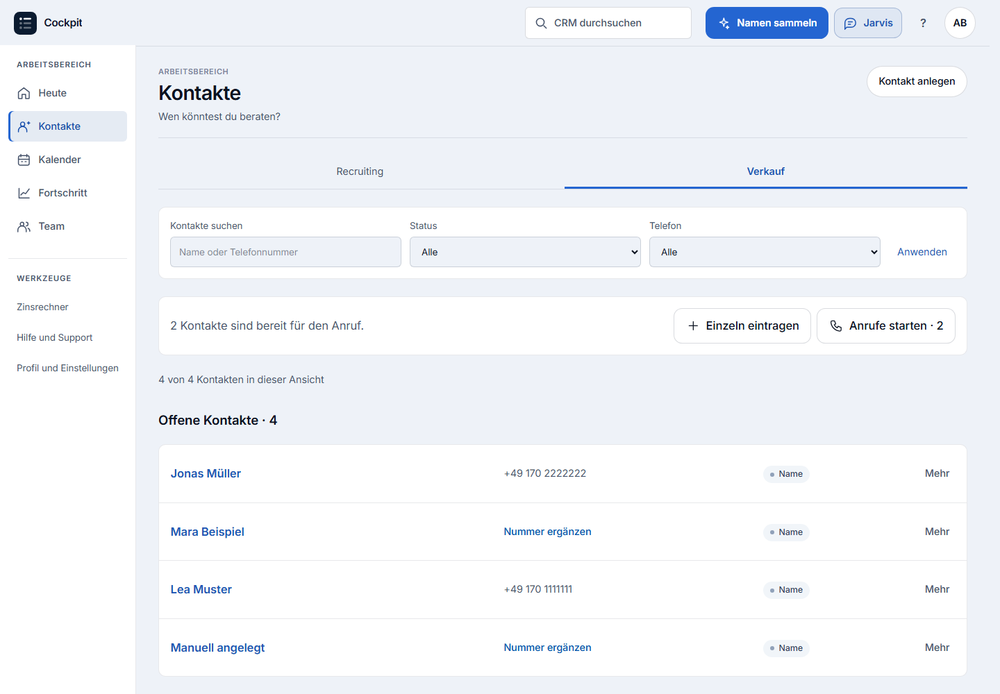
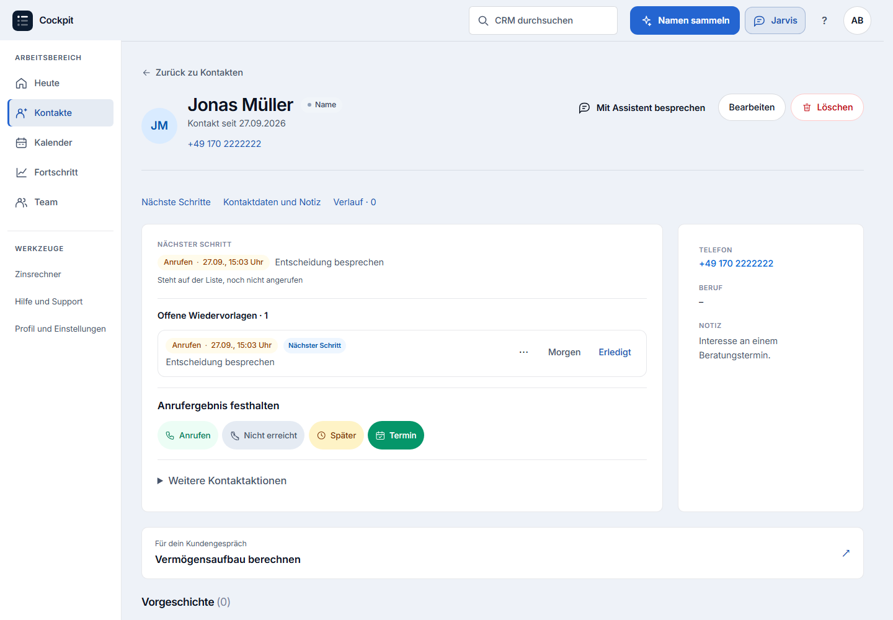
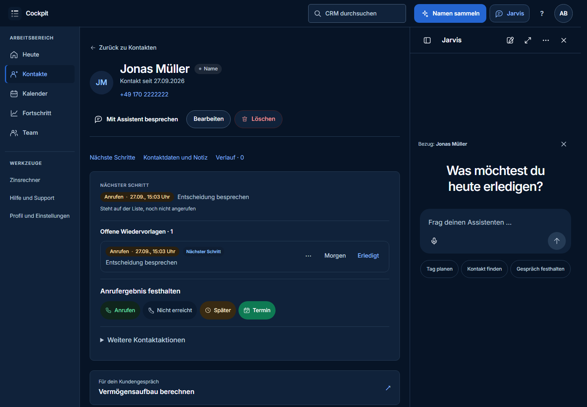
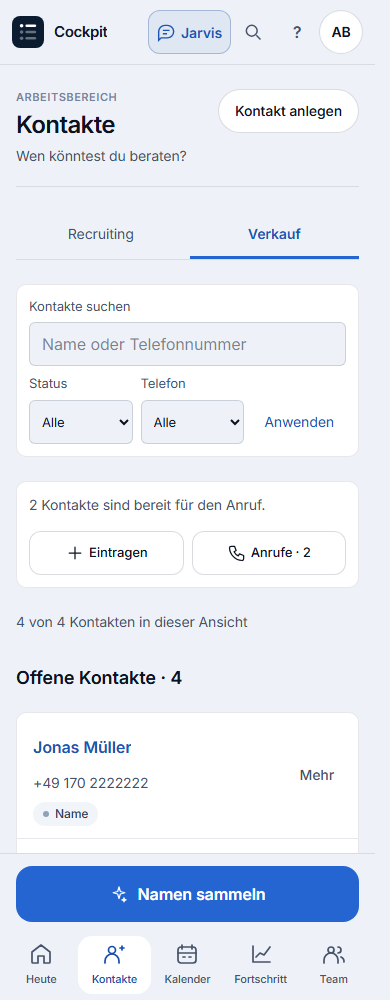
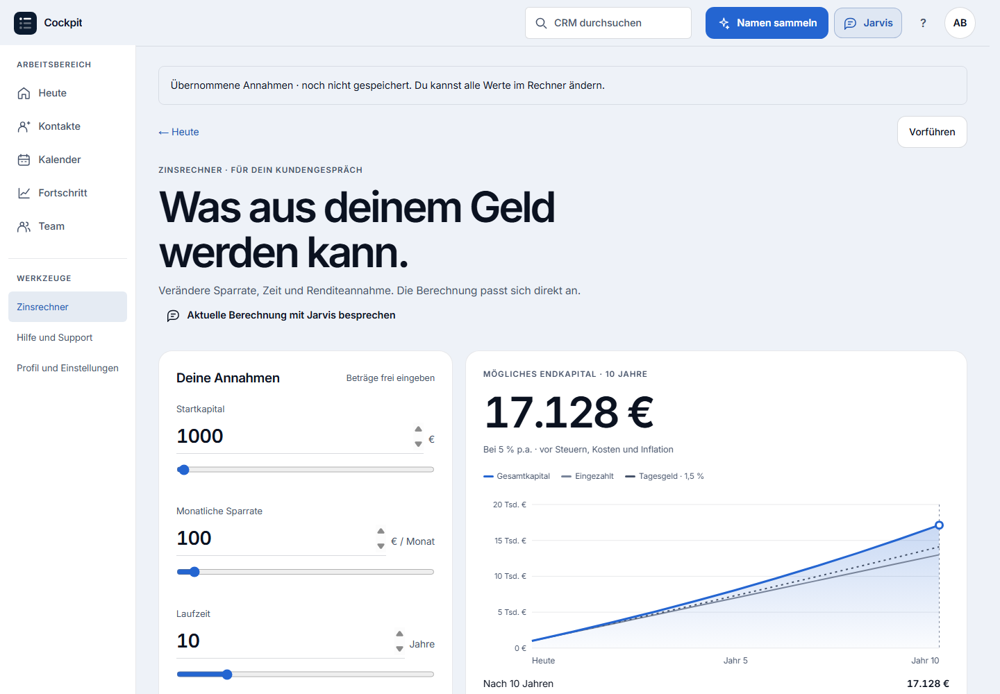
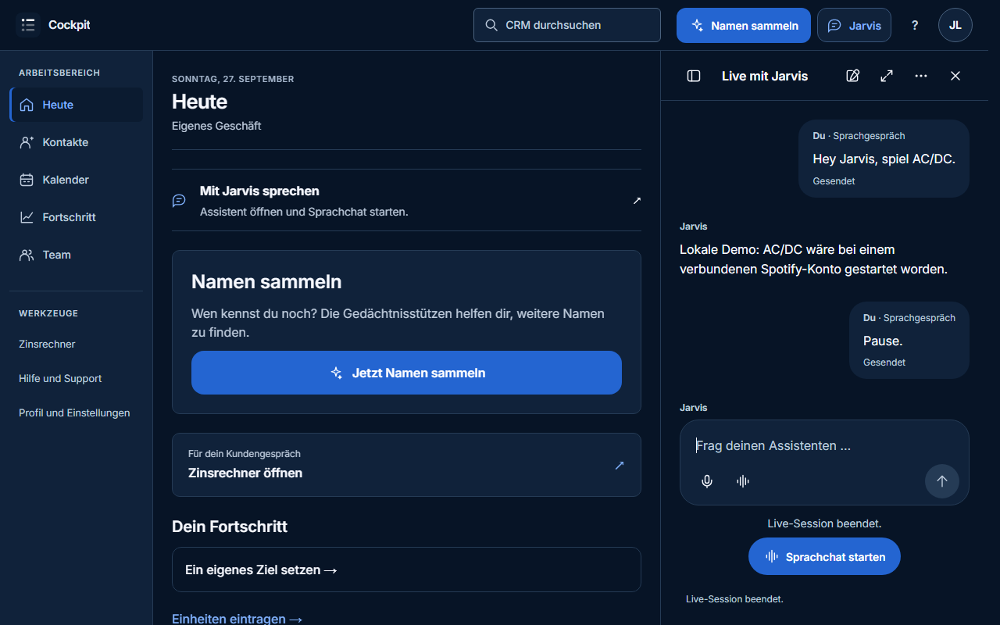

# HubSpot-Ausrichtung – lokale Abnahme

Stand: 27. September 2026. Grundlage: [verbindliche Produkt- und Designausrichtung](produkt-design-hubspot.md).

## Ergebnis und Umfang

Die vorhandene Anwendung hat eine gemeinsame Desktop-Navigation, verlässliche globale Aktionen und eine ruhigere Gestaltung mit den bestehenden Navy-/Blau-Farben erhalten. Kontakte bilden den vollständigen Referenzablauf aus Liste, Datensatz und Bearbeitung. Heute, Kalender, vorhandene Wiedervorlagen, Rechner und Hilfe nutzen diese gemeinsame Umgebung. Ihre bestehenden fachlichen Funktionen bleiben maßgeblich.

Jarvis arbeitet im bestehenden Assistenten und mit den bestehenden Serveraktionen. Ein geöffnetes Kontaktprofil kann als sichtbarer Gesprächsbezug übernommen werden. Bei einem Wechsel zu einem anderen Kontakt bleibt der bisherige Bezug erkennbar und kann bewusst ersetzt werden. Geänderte Kontaktnamen werden im Bezug aktualisiert. Das Desktop-Panel lässt die aktuelle Aufgabe benutzbar; die zusätzliche Kontaktspalte weicht bei knapper Breite einer einspaltigen Ansicht.

Die frühere allgemeine ChatGPT-/Claude-Ausrichtung ist für das Gesamtprodukt durch HubSpot ersetzt. Es wurden keine neuen Vertriebs- oder Servicemodule eingeführt. Die bestehende mobile Navigation mit fünf Zielen, Namen sammeln und Mini-Emils Rolle bleiben erhalten.

## Drei nachgewiesene Arbeitsweisen

| Arbeitsweise | Geprüfter Ablauf | Nachweis |
| --- | --- | --- |
| Manuell | Kontakt suchen, nach Status filtern, öffnen, Telefonnummer bearbeiten und speichern, zur gefilterten Liste zurückkehren. Zusätzlich einen Kontakt in der ausgewählten Liste anlegen. | Tatsächliche Serveraktionen; gespeicherter Datenbankwert und Listenart geprüft. Jarvis bleibt geschlossen, es entsteht keine Modellanfrage. |
| Mit Jarvis | Eine Telefonänderung vorbereiten und bestätigen. | Die Modellantwort wird lokal simuliert; die bestätigte Aktion läuft über den tatsächlichen Server. Datenbank und sichtbarer Kontakt zeigen anschließend denselben neuen Wert. |
| Gemischt | Jarvis schlägt eine Telefonänderung vor; der Nutzer bearbeitet das Feld, übernimmt die neue Vorschau und bestätigt. | Der bearbeitete Wert wird tatsächlich gespeichert. Ein Transaktionstest weist nach, dass die alte Bestätigung wirkungslos ist und zwei Bestätigungen der neuen Vorschau nur einen erfolgreichen Audit-Eintrag erzeugen. |

Die Telefonwerte im Prüflauf wechseln von `+49 170 2222222` über `+49 170 7654321` zu `+49 170 3333333`. Alle gezeigten Personen und Kontaktdaten sind synthetische Testdaten.

## Ansichten und Begründung

### Kontaktliste auf dem Desktop



HubSpots Muster aus Bereichsnavigation, Ansichtsreitern und Filtern über den Datensätzen wird auf die vorhandenen Verkauf-/Recruiting-Listen übertragen. Telefon, tatsächlicher Kontaktstatus und weitere Aktionen stehen in einer gut vergleichbaren Zeile. Der Rücksprung aus Detail und Bearbeitung enthält die aktuelle Suche und Filter. Anrufe starten und Namen erfassen bleiben direkt möglich.

### Kontaktprofil mit Arbeitsbereich und Kontext



Name, Telefonnummer und Aktionen stehen oben. Wiedervorlagen und Gesprächsergebnisse bilden den Arbeitsbereich; Telefon, Beruf und Notiz stehen bei ausreichender Breite daneben. Der Verlauf bleibt im selben Datensatz erreichbar. Die Gestaltung verbindet den klaren Kopf der neueren HubSpot-Ansicht mit der inhaltlichen Trennung der klassischen Ansicht. Es gibt keine wechselnden Beta-/Klassisch-Layouts.

### Kontakt und Jarvis nebeneinander



Das Panel greift den Breeze-Grundgedanken auf: Hilfe im aktuellen Arbeitskontext. Die Kontaktfläche bleibt bedienbar und passt sich der verfügbaren Breite an. F6 wechselt zwischen CRM und Jarvis. Diese Aufnahme stammt aus der Textprüfung mit abgeschaltetem Sprachprovider; die Sprachoberfläche wird separat geprüft.

### Mobile Kontaktarbeit



Auf Mobilgeräten bleiben die fünf Hauptziele und Namen sammeln an ihrem bisherigen Platz. Suche und Filter sind direkt bedienbar; zusätzliche Kontaktaktionen wurden kompakter angeordnet. Geprüft wurden auch 320 Pixel Breite und das vollständige Kontaktformular.

### Rechner und Hilfe



Jarvis verwendet dieselbe Rechenfunktion und dieselben Eingabegrenzen wie der vorhandene Rechner. Ein Link übergibt die Annahmen zur manuellen Prüfung; er legt kein gespeichertes Szenario an. Aktuelle manuelle Werte können wieder in das Gespräch übernommen werden. Hilfe und Jarvis lesen dieselben hinterlegten Anleitungen und verweisen auf die tatsächliche Rückmeldefunktion.

### Sprachchat und sichtbarer Verlauf



Der separate Sprachtest verwendet ein simuliertes Mikrofon, simulierte Sprachausgabe und den lokalen Mock-Provider. Geprüft sind der globale Einstieg, Unterbrechen, finale Antwort, Verlauf nach Sitzungsende sowie das Stoppen der Mikrofonspuren und das Freigeben der serverseitigen Sitzung. Mobil bleiben die Sprachsteuerung und das Sitzungsende erreichbar. [Mobile Sprachansicht](design/hubspot-workspace-2026-09-27/mobile-live-listening.png) und [Prüfergebnis](design/hubspot-workspace-2026-09-27/voice-result.json) sind gesichert.

Zwei dabei gefundene Oberflächenfehler wurden behoben: Die Sprachstartansicht verdeckt einen vorhandenen Verlauf nicht mehr, und die Startschaltfläche übernimmt den gesperrten Zustand des Controllers während des Ladens. Die Startsperre wird sowohl für Simulation als auch für den echten Sprachcontroller weitergegeben; der echte Provider wurde dabei nicht kontaktiert.

## Prüfungsergebnisse

| Prüfung | Ergebnis |
| --- | --- |
| Fachliche Tests für Arbeitsbereich, bestehende Jarvis-UX und Live-Grundfunktionen | 28 bestanden, 0 fehlgeschlagen. |
| Statische Prüfung der geänderten Oberfläche | Bestanden. |
| Arbeitsbereich im Browser | Bestanden: alle drei Arbeitsweisen, sieben Seiten bei vier Breiten, Tastaturwechsel und Touch-Ziele. Keine JavaScript-Ausnahmen oder Konsolenfehler. |
| Sprachoberfläche im Browser | Bestanden bei 1280×800 und 375×812: lokale Simulation, Unterbrechen, Verlauf, Sitzungsende, Mikrofonbereinigung, mobile Navigation sowie Konsole und Netzwerkanfragen. |
| Isolierter Anwendungsbuild | Bestanden, Exitcode 0: Kompilierung, Lint/Typprüfung und Seitenerzeugung vollständig abgeschlossen. |

Die Browserprüfung umfasst Kontakte, Kontaktprofil, Kontaktbearbeitung, Heute, Kalender, Hilfe und Rechner bei 320, 390, 768 und 1440 Pixel Breite. Sie prüft horizontale Überläufe, die unveränderte Hauptnavigation, mindestens 44 Pixel große globale Touch-Ziele, Formularfokus und Tastaturreihenfolge, nutzbare Arbeitsfläche neben Jarvis sowie Öffnen ohne Mikrofonanforderung. Hell-/Dunkelaufnahmen ergänzen die Sichtprüfung. Diese Stichproben sind keine vollständige WCAG-Zertifizierung.

Gesicherte Nachweise: [Browserergebnis](design/hubspot-workspace-2026-09-27/result.json), [28 fachliche Tests](design/hubspot-workspace-2026-09-27/domain-tests.log), [Buildprotokoll](design/hubspot-workspace-2026-09-27/build.log), [Heute](design/hubspot-workspace-2026-09-27/today-1440-light.png), [Kalender](design/hubspot-workspace-2026-09-27/calendar-1440-light.png), [Hilfe](design/hubspot-workspace-2026-09-27/help-1440-light.png), [Kontaktformular mobil](design/hubspot-workspace-2026-09-27/edit-390-light.png) und [Jarvis mobil](design/hubspot-workspace-2026-09-27/jarvis-390.png).

Reproduzierbare Prüfungen:

```text
node --import ./scripts/alias-hook.mjs --test scripts/hubspot-workspace.test.mjs scripts/ai-crm-ux.test.mjs scripts/ai-crm-live.test.mjs scripts/ai-crm-live-session.test.mjs scripts/ai-crm-live-turn.test.mjs
node --import ./scripts/alias-hook.mjs scripts/hubspot-workspace-browser.mjs
npm run test:ai:live:browser
npm run build:ai:ux:check
```

Die Browserläufe sollten nacheinander ausgeführt werden. Sie verwenden kurzlebige lokale Testdatenbanken und eigene Ausgabeverzeichnisse. Der Build-Prüfer ruft den Next-Build direkt mit einer isolierten Testdatenbank auf; `npm run build` mit seiner regulären Datenbankmigration wurde nicht ausgeführt.

## Grenzen und Veröffentlichungsstand

- **Lokal umgesetzt:** Änderungen im bestehenden Checkout; vorhandene lokale Jarvis-Weiterentwicklungen wurden erhalten.
- **Automatisch geprüft:** Reale Anwendungsseiten und Serveraktionen mit synthetischen Daten. Textmodell, Mikrofon und Sprachausgabe sind in den jeweiligen Browserprüfungen simuliert. Eine simulierte Musikantwort ist kein echter Spotify-Erfolg.
- **Noch separat abzunehmen:** Echte OpenAI-Sprachverbindung, reale Mikrofone/Lautsprecher, physische Mobilgeräte und Screenreader. Browsergrößen sind Geräteemulation, keine Hardwareabnahme.
- **Nicht veröffentlicht:** Durch diese Umsetzung kein Commit, Push, Preview- oder Production-Deployment und keine Migration einer externen Datenbank.
