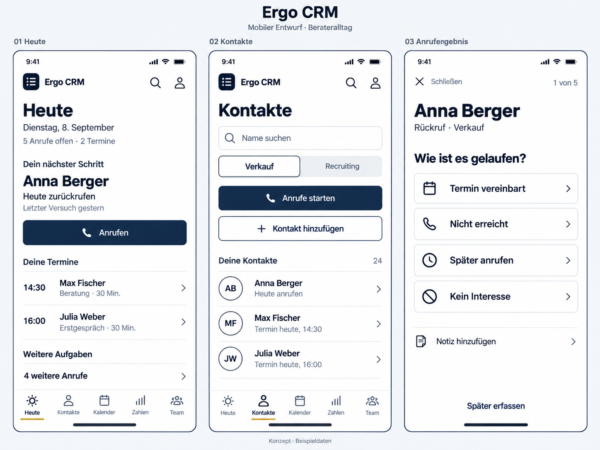

# Ergo CRM – mobiler Designentwurf V1

Stand: 08.09.2026. Historische Bildentwürfe; die Umsetzung folgt jetzt [Arbeitslagen](arbeitslagen-umsetzung.md).

**Verbindlicher Stand:** Der Nutzer hat die neue Farbpalettenrunde verworfen und Navy/Blau/Weiß bestätigt. Die iPhone-Anordnungen V3 bilden die Grundlage der drei mitwachsenden Arbeitsansichten. Umsetzung ist ausdrücklich beauftragt; siehe [Arbeitslagen](arbeitslagen-umsetzung.md).

**Fortschreibung nach visueller Rückmeldung:** Die Richtung für Findbarkeit passt, die helle Gestaltung ist noch nicht akzeptiert. Der Nutzer wünscht dunklere, professioneller wirkende Alternativen. Dafür liegen [drei dunkle Designrichtungen](design/dunkle-varianten-v2.md) vor. Die Auswahl ist offen; die Hellmodus-Tafel unten bleibt als früherer Entwurfsstand dokumentiert.

**Aktueller Zwischenstand:** Unter den dunklen Varianten bevorzugt der Nutzer B – Navy. Weitere Entwürfe sollen bei gleicher Farbgrundlage stärker mit vertrauten iPhone-Anordnungen und Mustern aus Trade Republic und anderen Apps arbeiten. Navy ist gespeichert; die endgültige Gestaltung wird anhand weiterer Bilder gewählt. Die Planung bleibt ohne App-Implementierung.

Zielgruppe: Berater im Alltag am Handy. Grundlage sind der lokale Projektstand und die gemeinsame Planung. Die angemeldeten Live-Ansichten wurden nicht geprüft. Alle Namen, Termine und Mengen im Bild sind Beispieldaten.

Das Bild zeigt die Gestaltungsrichtung im Hellmodus. Es ist ein generierter Bildentwurf, kein bedienbarer Prototyp. Exakte Abstände, Farbwerte, Kontraste und Textskalierung sind anhand der folgenden Vorgaben im späteren Layout zu prüfen. Der Dunkelmodus ist hier noch nicht visuell ausgearbeitet.

## 1. Festgelegte Richtung

- Verbindlich: dunkles Navy, blaue Akzente, weiße Schrift. V4 ist verworfen. Fachliche Zustände bleiben verständlich.
- Große, lesbare Arbeitsinhalte und großzügige Berührungsflächen.
- Pro Ansicht eine erkennbare Aufgabe. Aktionen erst dort anbieten, wo man sie benötigt.
- Vertikal scrollen; alle Hauptbereiche bleiben in der unteren Navigation sichtbar.
- Wiederkehrende Ziele haben feste Plätze. Suche ergänzt diese Ordnung.
- Bestehende Fachlogik, Kontaktzuständigkeiten und Zugriffsrechte bleiben Grundlage. Das Verschieben einer Funktion darf keine Berechtigung erweitern.

## 2. Hauptnavigation und Funktionszuordnung

| Sichtbarer Bereich | Zweck und Inhalte | Vorhandene Ausgangspunkte |
| --- | --- | --- |
| Heute | Nächster Schritt, heutige Termine, fällige Aufgaben | `/heute` |
| Kontakte | Recruiting-/Verkaufsliste, Kontakte aufnehmen, Namen sammeln, Anrufe, Kontaktprofil | `/namen`, `/namen/sammeln`, `/namen/nummern`, `/namen/anrufen`, `/contacts/...` |
| Kalender | Termine ansehen und anlegen; Kalenderanbindungen in den Einstellungen dieses Bereichs | `/kalender`, `/kalender/neu`, `/kalender/abo`, `/kalender/quellen` |
| Zahlen | Eigener Trichter, Einheiten, Aktivitäten nachtragen | `/trichter`, `/einheiten`, `/log` |
| Team | Mannschaft, Personen einladen, Rangliste und Wettbewerb als eindeutig beschriftete Unterbereiche | `/mannschaft`, `/einladen`, `/arena`, `/leaderboard`, `/spiel` |
| Profil, über die Kopfzeile | Konto, Darstellung, Benachrichtigungseinstellungen, Feedback, Abmelden; Verwaltung nur für Berechtigte | vorhandene Konto-, Melde-, Feedback- und Adminfunktionen |

„Kontakte“ bezeichnet die bestehende Namensliste; daraus entsteht kein zusätzliches Kontaktmodul. „Team“ fasst die bisherigen Begriffe Mannschaft und Team im Einstieg zusammen. Die reine Kontenverwaltung heißt innerhalb dieses Bereichs beziehungsweise im Profil ausdrücklich „Verwaltung“ und erscheint nur für Admins.

Die Zuordnung ist ein Navigationsentwurf. Sie legt keine neue URL-Struktur fest. Bestehende Links sollen bei einer späteren Umsetzung weiter zum richtigen Ziel führen. Recruiting/Verkauf bleiben am selben Kontakt nutzbar; der gewählte Kontext bleibt beim Wechsel in den Anrufablauf erhalten.

### Kopfzeile und Suche

Auf Hauptseiten: kompakte Marke, klar erkennbarer Suchzugang und Profil. Die Suche steckt nicht mehr hinter dem Plus. Die Suchfunktion in der Kopfzeile findet Aktionen und Bereiche über den vorhandenen Wegweiser; das Feld „Name suchen“ filtert die Kontakte der gewählten Liste. Beide Zwecke werden auch für Screenreader eindeutig beschriftet. Die Kontaktsuche ist eine vorgeschlagene Ergänzung und keine bereits vorhandene Fähigkeit des Wegweisers.

In fokussierten Abläufen ersetzt eine Kopfzeile mit Rückweg und Fortschritt die Hauptnavigation. Nach dem Schließen kehrt der Nutzer zur vorherigen Seite mit bisheriger Auswahl und Scrollposition zurück.

## 3. Ansicht Heute

**Leitfrage: Was mache ich als Nächstes?**

Reihenfolge im normalen, gefüllten Zustand:

1. Großer Titel „Heute“, Datum, eine kompakte Zusammenfassung wie „5 Anrufe offen · 2 Termine“.
2. „Dein nächster Schritt“ mit einer Person, einem kurzen Anlass und einer Hauptaktion.
3. „Deine Termine“ als große Zeilen mit Uhrzeit, Name und Anlass.
4. „Weitere Aufgaben“ mit beschrifteten Einstiegen und Mengen. Die vollständigen fälligen Aufgaben sind von hier erreichbar.

### Verhalten

- **Anrufen:** bereitet den fokussierten Anrufablauf für genau diesen Kontakt vor und startet durch diesen bewussten Tipp den Telefon-Link. Nach der Rückkehr steht die Ergebnisfrage für dieselbe Person bereit. Der schnelle Einstieg soll keine zusätzliche Bestätigung in der App benötigen; eine mögliche Nachfrage des Betriebssystems bleibt erhalten. Antippen des Namens öffnet zunächst die Vorbereitung mit Kontext und Gesprächshilfe. Kein automatischer Anruf durch bloßen Seitenaufruf. Das Zusammenspiel mit dem mobilen Browser ist am späteren Prototyp zu prüfen.
- **Terminzeile:** öffnet die Termininformation und die dazu passenden Aktionen. Ein vergangener Termin bietet die Ergebniserfassung direkt an.
- **Weitere Anrufe:** öffnet die übrigen fälligen Kontakte mit dem passenden Kontext. Ein weiterer Kontakt lässt sich gezielt wählen.
- Ein bevorstehender Termin oder eine überfällige Aufgabe kann den hervorgehobenen Schritt bestimmen. Die Auswahl muss sich aus vorhandener Fälligkeit erklären lassen. Für den Entwurf wird kein zusätzlicher undurchsichtiger Score eingeführt.
- Führungshinweise erscheinen nur bei konkretem Handlungsbedarf und führen zur betreffenden Person. Sie verdrängen die Tagesarbeit nicht dauerhaft.
- Nachrichten bekommen einen beschrifteten Einstieg mit Anzahl ungelesener Nachrichten. Ihr Inhalt ist nicht ständig vor der Tagesarbeit ausgebreitet.
- Einsteiger sehen höchstens einen passenden Startimpuls gleichzeitig. Der bestehende Starterpass bleibt über einen klaren Einstieg erreichbar.

### Abweichende Zustände

| Zustand | Geplante Darstellung |
| --- | --- |
| Noch keine Kontakte | Hauptaktion „Erste Namen sammeln“ führt direkt in die geführte Sammlung; kein vorgeschalteter Umweg über „Kontakt hinzufügen“ |
| Heute alles erledigt | „Für heute alles erledigt“, danach nächster Termin; keine künstlich dringende Aufgabe |
| Überfällige Aufgaben | Sichtbare Anzahl und Klartext „überfällig“; Zugang zu allen betroffenen Aufgaben bleibt erhalten |
| Kontakt ohne Telefonnummer | „Telefonnummer ergänzen“ anstelle einer nicht ausführbaren Telefonaktion |
| Mehrere dringende Hinweise | Ein kompakter, beschrifteter Einstieg; keine Folge großer Warnkarten vor dem Hauptinhalt |

## 4. Ansicht Kontakte

**Leitfrage: Wen suche ich oder wen möchte ich bearbeiten?**

Reihenfolge: Titel → „Name suchen“ → Verkauf/Recruiting → „Anrufe starten“ → sekundär „Kontakt hinzufügen“ → Kontaktliste.

Jede Listenzeile zeigt Name, einen relevanten nächsten Schritt oder Termin und einen eindeutigen Zugang zum Profil. Die Beispielinitialen helfen der Orientierung. Kleine Aktionsgruppen, Verwaltungsfelder und sämtliche Ergebnisse pro Zeile entfallen im Normalzustand.

### Verhalten

- **Anrufe starten:** nutzt den vorhandenen Durchlauf und dessen Priorisierung innerhalb der gewählten Liste.
- **Kontakt hinzufügen:** öffnet eine kurze Erfassung mit Name und optionaler Nummer. Die gewählte Liste wird übernommen. Weitere Angaben sind optional und erscheinen bei Bedarf. Nach dem Speichern lässt sich direkt der nächste Name aufnehmen.
- **Namen sammeln:** bleibt als beschrifteter Einstieg innerhalb der Kontakterfassung erreichbar; bei leerer Liste wird die Möglichkeit direkt angeboten.
- **Kontakt antippen:** öffnet Name, Nummer, letzten relevanten Kontakt und nächsten Schritt. Bearbeiten, Einstufen, Listenwechsel und Entfernen werden dort beziehungsweise in einer ausdrücklich benannten Listenbearbeitung angeboten.
- **Listen bearbeiten:** bleibt über einen beschrifteten Einstieg nach den Hauptaktionen erreichbar. Mehrfachauswahl wird erst in diesem Zustand eingeblendet.
- Erledigte und aussortierte Kontakte sind über „Erledigte Kontakte“ und „Aussortierte Kontakte“ mit Anzahl erreichbar; sie werden nicht stillschweigend gelöscht oder unauffindbar.
- Fehlende Nummern erhalten einen beschrifteten Einstieg „Telefonnummern ergänzen“. Wenn kein Kontakt angerufen werden kann, ersetzt diese Aktion „Anrufe starten“.
- Eine Suche ohne Treffer bietet „Suche zurücksetzen“ und „Kontakt hinzufügen“ an. Eine leere gewählte Liste wird von einer erfolglosen Suche unterschieden.

## 5. Anrufablauf

**Leitfrage vor dem Anruf: Wen rufe ich warum an? Danach: Was kam heraus?**

### Vor dem Anruf

- Kopfzeile: „Schließen“ und Fortschritt, beispielsweise „1 von 5“.
- Person groß; darunter Rückruf/Erstanruf und gewählte Liste.
- Letzter Versuch, kurze Notiz und Empfehlungsgeber, soweit vorhanden. Der Empfehlungsgeber bleibt vor dem Telefonat sichtbar.
- Eine große Hauptaktion „Anrufen“; die Nummer ist lesbar dargestellt.
- „Gesprächshilfe“ als beschrifteter, aufklappbarer Einstieg mit dem vorhandenen Leitfaden und der Einwandhilfe. Geöffnete Hilfe darf für die nächsten Kontakte offen bleiben.
- „Ergebnis erfassen“ ist auch manuell erreichbar, falls der Anruf außerhalb der App stattfand oder der Browser keine Rückkehr erkennt.

### Nach der Rückkehr – im Bild gezeigt

„Wie ist es gelaufen?“ mit vier gleichwertigen, großen Ergebniszeilen:

| Auswahl | Folge |
| --- | --- |
| Termin vereinbart | Kurze Termin-Erfassung mit vorhandenen Angaben; erst Speichern bestätigt das Ergebnis |
| Nicht erreicht | Bestehende Ergebnisaktion und Wiedervorlagelogik ausführen; Rückgängig anbieten |
| Später anrufen | Wiedervorlage mit verständlichen Zeitoptionen; erst Auswahl bestätigt |
| Kein Interesse | Vorhandene Ergebnis-/Grundauswahl verwenden; Konsequenz eindeutig benennen |

Eine Browser-Rückkehr beweist kein geführtes Gespräch. Sie rückt nur die Ergebnisfrage in den Vordergrund; es wird ohne bewusste Auswahl nichts gezählt, abgeschlossen oder als Erfolg gespeichert. Die vier Optionen erhalten keine Vorauswahl.

„Notiz hinzufügen“ ist optional und gehört zum aktuellen Kontakt. Beim späteren Wechsel darf ein Entwurf nicht versehentlich einem anderen Kontakt zugeordnet werden.

„Später erfassen“ bedeutet in diesem Entwurf: aktuellen Kontakt ohne Ergebnis überspringen. Er behält seinen offenen nächsten Schritt und bleibt auf Heute beziehungsweise in der Kontaktliste auffindbar. Es entsteht kein neuer unsichtbarer Aufgabenstatus. Der Zähler für erledigte Anrufe steigt dadurch nicht.

Nach einem erfolgreich gespeicherten Ergebnis erscheint der nächste Kontakt. Eine gut erreichbare Rückgängig-Aktion bleibt verfügbar. Bei einem Speicherfehler bleibt der aktuelle Kontakt mit den eingegebenen Werten offen; Wiederholen erzeugt keinen doppelten Eintrag. Schließen ohne Ergebnis hält den Kontakt offen. Ungespeicherte Eingaben in einem geöffneten Formular dürfen nicht unbemerkt verloren gehen.

Am Ende steht eine kurze Bilanz aus tatsächlich gespeicherten Ergebnissen mit Rückweg zu Heute oder Kontakte. Der Empfehlungsablauf nach gehaltenen Terminen und die Einheitenfrage nach einem Abschluss bleiben erhalten; sie werden nicht durch diesen Anrufentwurf ersetzt.

## 6. Visuelle Vorgaben aus V1 – Farbwerte inzwischen überholt

Die konkreten Farben dieser Tabelle dokumentieren V1. Sie sind durch die neue Farbwahlrunde V4 abgelöst; Größen- und Bedienvorgaben bleiben Ausgangspunkte für die weitere Planung.

| Element | Entwurfsvorgabe |
| --- | --- |
| Ausgangsformat | 390 × 844 CSS-Pixel; zusätzlich schmale Ansichten ab 320 Pixel prüfen |
| Hauptfläche hell | Vorhandenes Weiß `#ffffff`; Canvas `#f4f6fa` sparsam zur Gruppierung |
| Haupttext | Vorhandenes Ink `#0f172a` |
| Sekundärtext | Vorhandenes Ink-muted `#4d5a70`; keine verringerte Deckkraft für nötige Informationen |
| Hauptaktion | Vorhandenes Navy `#12233c`, weiße Beschriftung |
| Gold | `#d4a942` als sparsamer Akzent, nicht als kleine Schrift auf Weiß |
| Seitentitel | 32–36 Pixel, semibold; vorhandene Inter-Schrift |
| Person im Fokus | 28–32 Pixel, semibold |
| Arbeitsinhalt | 16–17 Pixel; wichtige Hilfstexte mindestens 14 Pixel |
| Hauptaktion | 56 Pixel Mindesthöhe |
| Ergebniszeilen | 64 Pixel Mindesthöhe, gleiches visuelles Gewicht |
| Berührungsfläche | Mindestens 44 × 44 CSS-Pixel; größere Bereiche bei Hauptaktionen |
| Außenabstand | Ausgangspunkt 20 Pixel; bei sehr schmalen Ansichten 16 Pixel |
| Abschnittsabstand | 24–32 Pixel; größere Nähe innerhalb einer Gruppe |
| Radien | Etwa 12 Pixel für Aktionen; Kreise nur für passende Symbole/Initialen |
| Flächen und Linien | Opaque Flächen, klare Trennlinien, keine dekorativen Kartenschatten oder Verlaufsflächen |
| Aktiver Tab | Dunkles Icon und Text, zusätzliche Markierung; nicht allein durch Gold unterscheidbar |

Der Dunkelmodus wird mit den vorhandenen dunklen Tokens ausgearbeitet: Canvas `#0c131e`, Surface `#141d2b`, Ink `#eaf0f7`, Ink-muted `#a9b5c6`. Er benötigt eigene Kontrastprüfung; das bloße Umkehren heller Farbstufen reicht nicht als Abnahme.

Schriftgrößen und Mindesthöhen sind Ausgangswerte, keine starren Containerhöhen. Größere Systemschrift darf Umbruch und höhere Zeilen erzeugen. Tastatur, Home-Indikator und Rückgängig-Leiste dürfen wichtige Aktionen nicht verdecken. Die Bildschirmdarstellung im Bild beweist diese Eigenschaften noch nicht.

## 7. Prüfung vor der Umsetzung

Ein späterer bedienbarer Entwurf wird mit neuen Nutzern anhand konkreter Aufgaben geprüft:

1. Öffne die App und benenne ohne Erklärung deinen nächsten Schritt.
2. Finde eine bestimmte Person und füge einen neuen Kontakt hinzu.
3. Starte einen fälligen Anruf und erfasse „Nicht erreicht“.
4. Vereinbare einen Termin und finde ihn anschließend im Kalender.
5. Unterbrich einen Anruf ohne Ergebnis und finde die Person wieder.
6. Finde „Einheiten eintragen“, „Jemanden einladen“ und die Gesprächshilfe.

Erfolgskriterium: Die Aufgaben gelingen ohne Hinweise darauf, wo eine Funktion versteckt ist. Hauptziele sind direkt über die Navigation erreichbar; eine seltenere Funktion soll normalerweise höchstens eine klar benannte Unterebene benötigen. Für fachliche Formularschritte gilt keine künstliche Zwei-Tipp-Grenze.

Zusätzlich prüfen: kein seitliches Scrollen der Hauptnavigation, lesbare Texte und Zustände bei größerer Schrift, alle wichtigen Bedienelemente im Einhandbetrieb, Kontrast in Hell und Dunkel, sinnvolle Tastatur- und Screenreader-Reihenfolge. Textkontrast für normalen Text mindestens 4,5:1; erforderliche nichttextliche Zustands- und Steuerelemente mindestens 3:1. Das sind Prüfvorgaben, keine bereits bestandenen Tests.

Referenzen: [Apple – UI Design Dos and Don’ts](https://developer.apple.com/design/tips/), [Apple – Sufficient Contrast](https://developer.apple.com/help/app-store-connect/manage-app-accessibility/sufficient-contrast-evaluation-criteria).

## 8. Stand und nächster Planungsschritt

Erstellt: eine visuelle Hellmodus-Tafel mit drei Ansichten, deren Beschriftungen und Interaktionen, die Funktionszuordnung sowie die wichtigsten Ausnahmezustände.

Noch offen: visuelle Rückmeldung zu dieser Richtung; Detailentwürfe für Kalender, Zahlen und Team; Dunkelmodus; bedienbarer Prototyp und Nutzungsprüfung. Diese Punkte sind nicht als bereits erledigt zu behandeln. Die App-Implementierung beginnt erst nach einem ausdrücklichen Wechsel aus der vereinbarten Planung.

Die Bildtafel wurde mit dem eingebauten Bildgenerator erstellt. Das zugehörige Bildbriefing liegt in [design/mobile-entwurf-v1-prompt.md](design/mobile-entwurf-v1-prompt.md).
